# QLSV

- Project Quản lí sinh viên
- Bài tập lớn Database 
- Cơ sở dữ liệu: 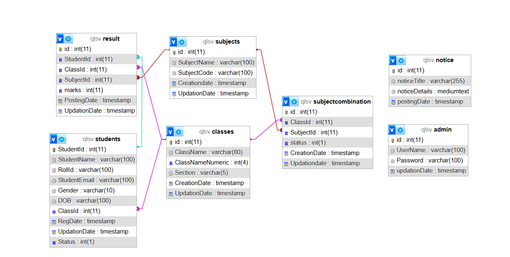

# Tác giả:
- Tên: Phan Tiến Đạt
- MSSV: 22024529
- Trường: UET - VNU

# Thông tin dự án :

- Front-end:
  - HTML Css Javascript
  - Sử dụng thư viện đồ họa bootstrap
- Back-end: Sử dụng Ngôn ngữ lập tình PHP

- Database: MySQL

# Mô tả project:

- Dự án này cung cấp một hệ thống quản lí sinh viên thông qua các lớp học, môn học và kết quả học tập của sinh viên. 

# Demo dự án:
- Video Youtube: https://youtu.be/ptTRJID7u6o?si=ZzFRRqkiGNOMAjPD
# Cách sử dụng:

- Clone project về thư mục C:\xampp\htdocs\qlsv
- Mở xampp và bật cơ sở dữ liệu MySQL và máy ảo Apache 
- Truy cập vào http://localhost/qlsv trên trình duyệt

# Các tính năng:

- # Kiểm tra thông báo:
  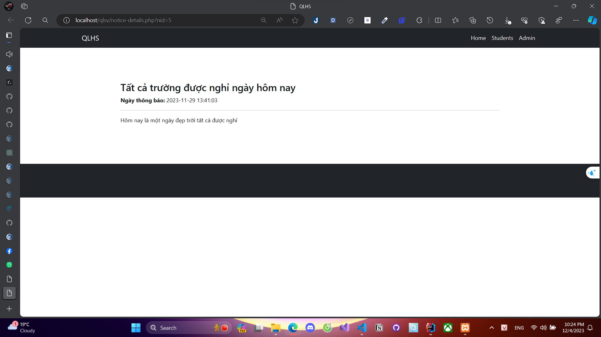

- Sinh viên có thể vào phần thông báo để nhận những thông báo mới.
- # Tra cứu kết quả của sinh viên:

  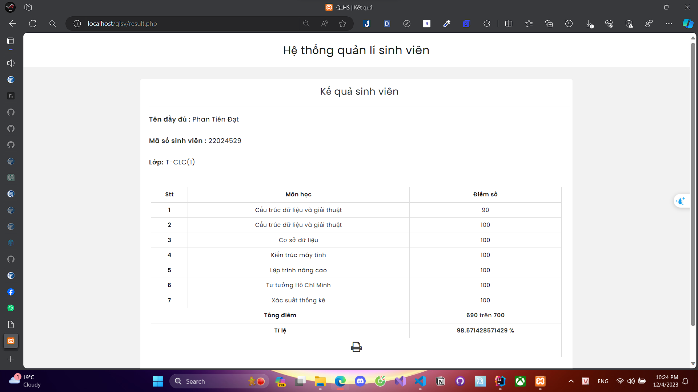

  - 

- # Đăng nhập tài khoản admin:

  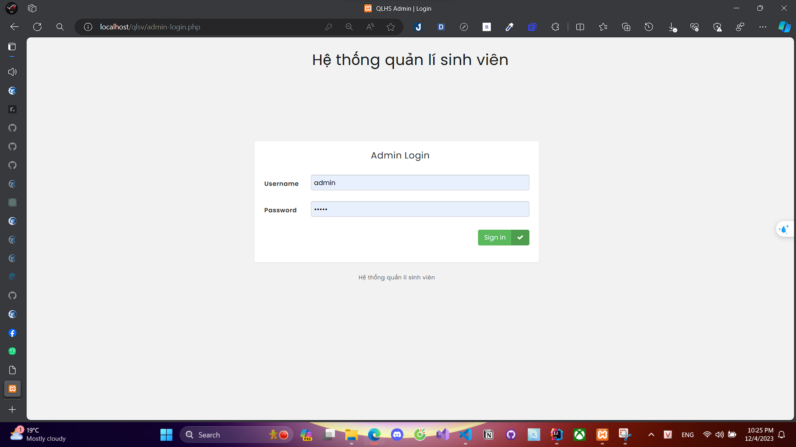

  
- # Dashboard:

  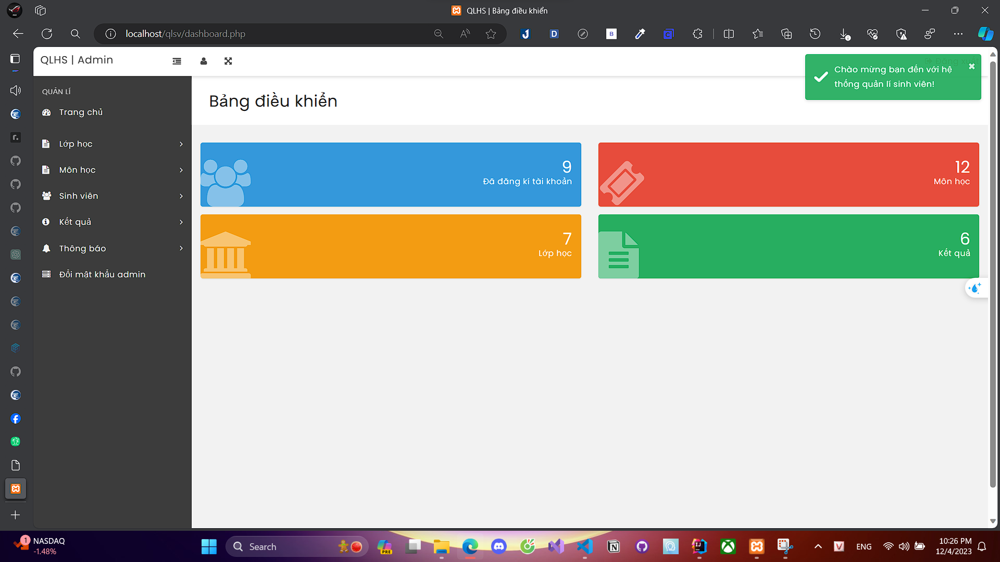

  - Hiển thị ra số các tài khoản đã đăng kí, số môn học, số lớp học và số kết quả đã nhập.

- # Classroom:

  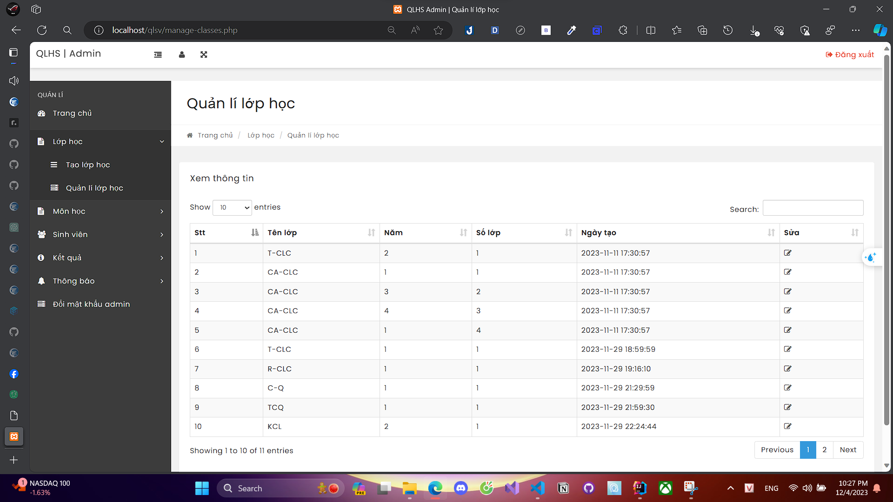

  - Tạo và quản lí các lớp học.

- # Subject:

  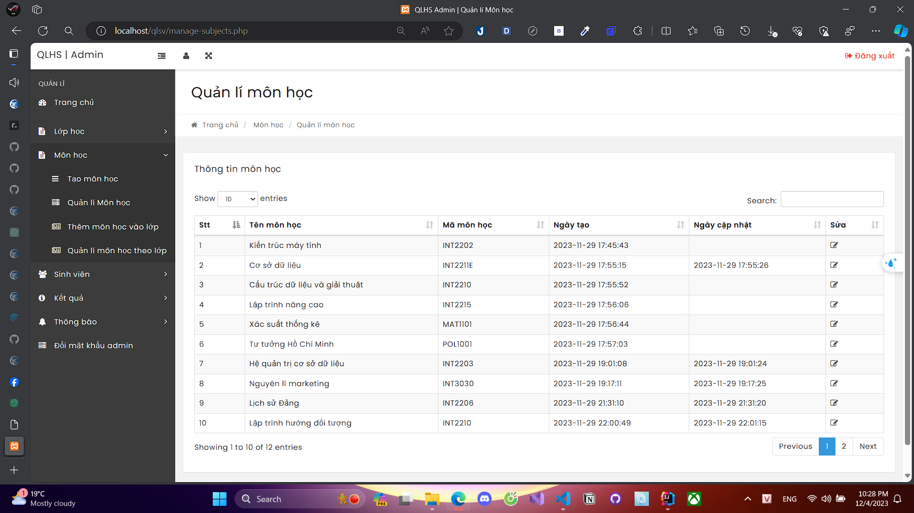
  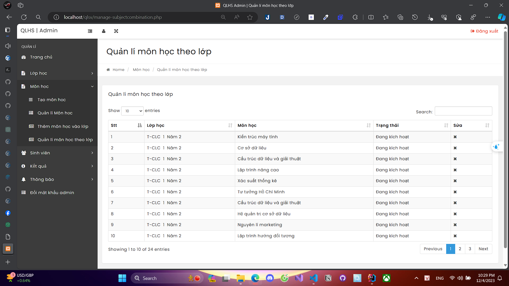

  - Tạo và quản lí các môn học.
  - Thêm các môn học vào các lớp học có sẵn.

- # Student:

  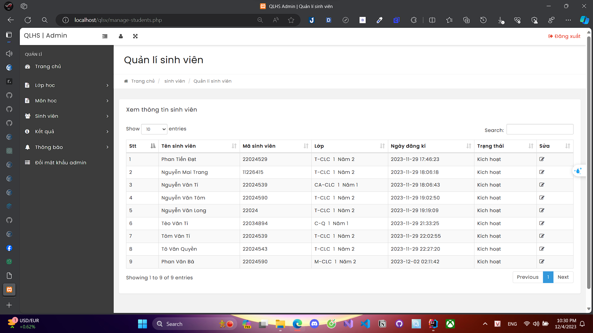

  - Tạo và quản lí các sinh viên.

- # Result:

  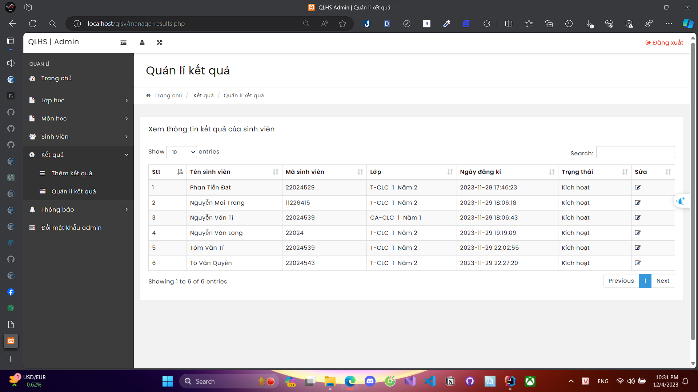

  - Nhập các kết quả cho các sinh viên.

- # Notice Manage:
    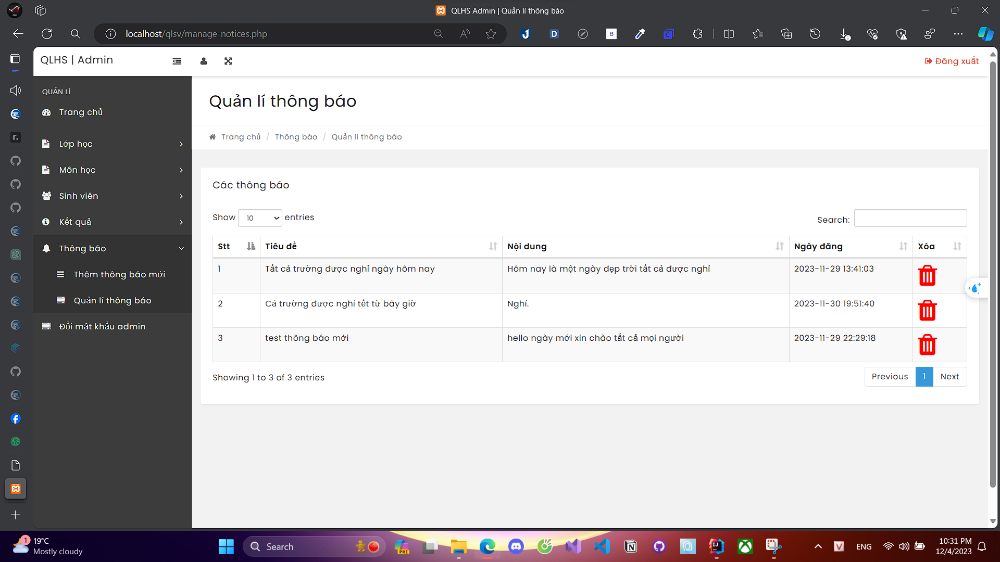
  - Quản lí thông báo.

